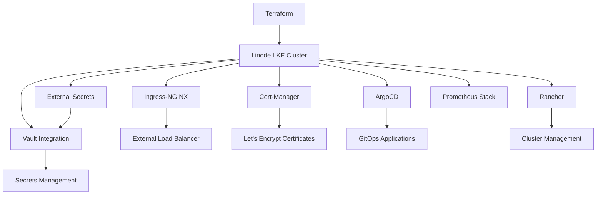

# 6degrees-management-cluster

Simple LKE Cluster with Rancher, ArgoCD, Vault, Cert-Manager(LetsEncrypt) using
Terraform and helm charts.

## Prerequisites

- Terraform >= 1.0.0
- Linode Account with API Token
- Helm 3.x
- kubectl

## Architecture Overview



## Repository Structure

```
.
├── terraform/               # Infrastructure as Code
├── kubernetes/              # Kubernetes components
│   ├── 00-system/          # Core System Components
│   │   ├── 01-ingress-nginx/  # Ingress Controller
│   │   ├── 02-cert-manager/   # Certificate Management
│   │   ├── 03-argocd/        # GitOps Platform
│   │   ├── 04-rancher/       # Cluster Management
│   │   ├── 05-vault/         # Secrets Management
│   │   └── 06-external-secrets/ # External Secrets Operator
│   └── 99-apps/            # Application Deployments
│       ├── 01-f6sny/       # F6sny Application Stack
│       ├── 02-testf6snyapi/# Test API Environment
│       └── 03-prometheus/  # Monitoring Stack
```

## Getting Started

1. Set up Terraform variables:
```bash
cp terraform/terraform.tfvars.example terraform/terraform.tfvars
```

2. Initialize Terraform:
```bash
cd terraform
terraform init
```

3. Apply the configuration:
```bash
terraform apply
```

4. Install Core Components:
```bash
# Install system components in order
## Install ingress-nginx
helm repo add ingress-nginx https://kubernetes.github.io/ingress-nginx
helm repo update
helm upgrade --install ingress ingress-nginx/ingress-nginx

## Install cert-manager
helm repo add jetstack https://charts.jetstack.io --force-update
helm upgrade --install cert-manager jetstack/cert-manager \
  --namespace cert-manager \
  --create-namespace \
  --set crds.enabled=true

kubectl apply -f ./kubernetes/02-cert-manager/http01-clusterissuer.yaml

# Install Argocd
helm repo add argo https://argoproj.github.io/argo-helm
helm upgrade --install argocd argo/argo-cd \
  --namespace argocd \
  --create-namespace \
  --values ./kubernetes/-3-argocd/values.yaml

# Install Rancher
helm repo add rancher-latest https://releases.rancher.com/server-charts/latest
helm upgrade --install rancher rancher-latest/rancher \
  --namespace cattle-system \
  --values kubernetes/04-rancher/values.yaml \
  --create-namespace

# Install Vault
helm upgrade --install vault hashicorp/vault --namespace "vault" --create-namespace \
    --set injector.enabled=false \
    --set server.ingress.enabled=true \
    --set 'server.ingress.annotations.cert-manager\.io/cluster-issuer=http01-clusterissuer' \
    --set server.ingress.ingressClassName=nginx \
    --set server.ingress.hosts[0].host=vault.6degrees.com.sa \
    --set server.ingress.tls[0].hosts[0]=vault.6degrees.com.sa \
    --set server.ingress.tls[0].secretName=vault-tls-cert

kubectl exec -n vault -it vault-0 -- vault operator init


# Install External Secrets Operator
helm repo add external-secrets https://charts.external-secrets.io
helm upgrade --install external-secrets external-secrets/external-secrets \
  --namespace external-secrets \
  --create-namespace \
  --values ./kubernetes/-7-external-secrets/values.yaml

## Create a policy in Vault
kubectl exec -it -n vault vault-0 -- /bin/sh
vault policy write external-secrets - <<EOF
path "kv/data/*" {
  capabilities = ["read"]
}
EOF

## Create a token with the policy
vault token create -policy=external-secrets

## Store the Vault token as a Kubernetes secret
kubectl create namespace external-secrets
kubectl create secret generic vault-token \
  --namespace external-secrets \
  --from-literal=token=<hvs.your-vault-token-here>

## Apply the ClusterSecretStore configuration
kubectl apply -f ./kubernetes/07-external-secrets/cluster-secret-store.yaml

# Install Longhorn
helm repo add longhorn https://charts.longhorn.io/
helm repo update

kubectl apply -f ./kubernetes/08-longhorn/external-secrets.yaml
kubectl get externalsecrets

helm upgrade --install longhorn longhorn/longhorn --namespace longhorn --create-namespace -f ./kubernetes/08-longhorn/values.yaml


```


## Security Considerations

- [ ] Use least-privilege access
- [ ] Rotate secrets regularly
- [ ] Implement network policies
- [ ] Enable audit logging
- [x] Use TLS for all components
- [x] Utilize External Secrets for sensitive data

## Maintenance

### Regular Tasks
- Update Helm charts
- Monitor certificate expiration
- Backup Vault data
- Review access controls
- Check External Secrets sync status

### Monitoring
- Access Prometheus at prometheus.domain.com
- Access Grafana at grafana.domain.com
- Configure alerts for critical components
- Monitor resource usage

## Troubleshooting

### Common Issues
- Certificate renewal failures
- Vault unseal required
- ArgoCD sync conflicts
- External Secrets sync failures
- Pod readiness issues

### Debug Commands
```bash
# Check pod status
kubectl get pods -A

# Check external secrets
kubectl get externalsecret -A

# View pod logs
kubectl logs -n <namespace> <pod-name>

# Check ingress status
kubectl get ingress -A
```

## Contributing

1. Fork the repository
2. Create your feature branch
3. Commit your changes
4. Push to the branch
5. Create a new Pull Request

## Credits
- [Basem Alaraj](https://gitlab.com/basemitdept)
  Special thanks to this invisible soldier.

## License

MIT License
