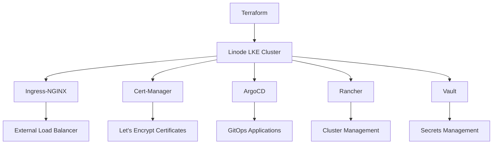

# 6degrees-management-cluster

Simple LKE Cluster with Rancher, ArgoCD, Vault, Cert-Manager(LetsEncrypt) using
Terraform and helm charts.

## Prerequisites

- Terraform >= 1.0.0
- Linode Account with API Token
- Helm 3.x
- kubectl

## Architecture Overview



## Repository Structure

```
.
├── terraform/               # Infrastructure as Code
├── kubernetes/              # Kubernetes components
│   ├── 01-ingress-nginx/    # Ingress Controller
│   ├── 02-cert-manager/     # Certificate Management
│   ├── 03-argocd/           # GitOps Platform
│   ├── 04-rancher/          # Cluster Management
│   └── 05-vault/           # Secrets Management
```

## Getting Started

1. Set up Terraform variables:
```bash
cp terraform/terraform.tfvars.example terraform/terraform.tfvars
```

2. Initialize Terraform:
```bash
cd terraform
terraform init
```

3. Apply the configuration:
```bash
terraform apply
```

4. Install Kubernetes components:
```

## Security Considerations

- Use least-privilege access
- Rotate secrets regularly
- Implement network policies
- Enable audit logging
- Use TLS for all components

## Maintenance

### Regular Tasks
- Update Helm charts
- Monitor certificate expiration
- Backup Vault data
- Review access controls

### Monitoring
- Set up Prometheus and Grafana
- Configure alerts for critical components
- Monitor resource usage

## Troubleshooting

### Common Issues
- Certificate renewal failures
- Vault unseal required
- ArgoCD sync conflicts
- Rancher cluster connectivity

### Logs
```bash
kubectl logs -n <namespace> <pod-name>
```

### Cluster Status
```bash
kubectl get all -A
```

## License

MIT License

## Contributing

1. Fork the repository
2. Create your feature branch
3. Commit your changes
4. Push to the branch
5. Create a new Pull Request
